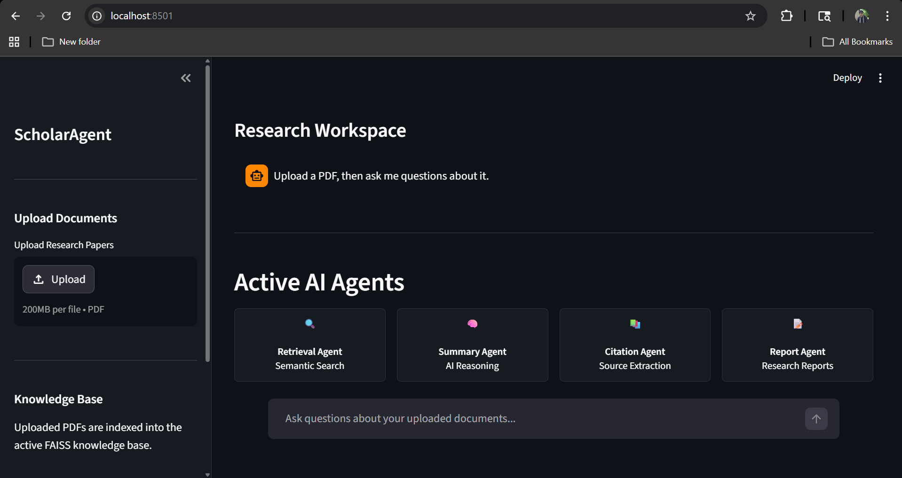
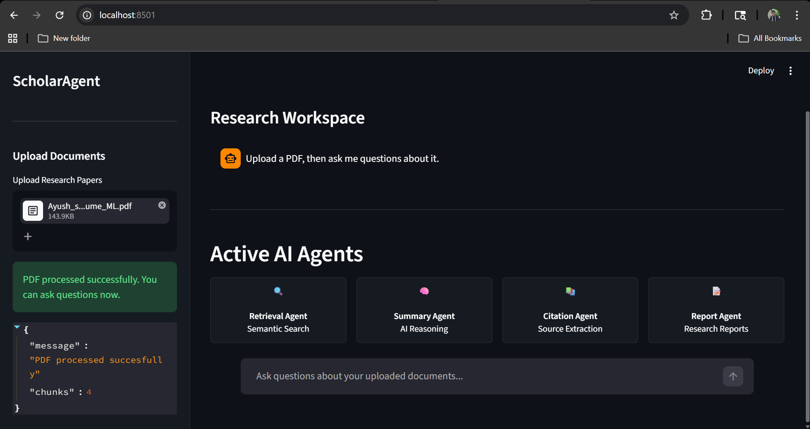
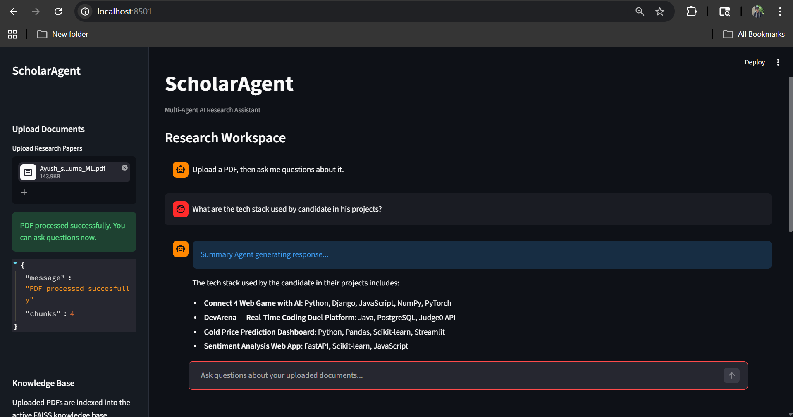
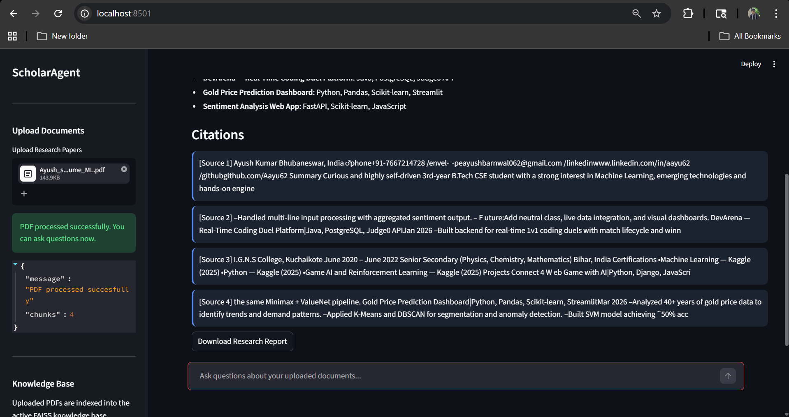
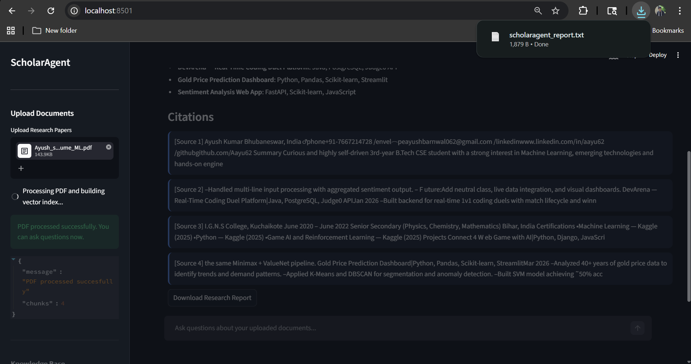

# ScholarAgent

Multi-Agent AI Research Assistant built using FastAPI, Streamlit, FAISS, Gemini API, and Retrieval-Augmented Generation (RAG).

ScholarAgent enables users to upload research PDFs, perform semantic document search, generate contextual AI answers, extract citations, and download structured research reports through an interactive multi-agent workflow.

---

## Features

* PDF Upload & Parsing
* Retrieval-Augmented Generation (RAG)
* Semantic Search using FAISS
* Multi-Agent Workflow
* Citation Extraction
* Research Report Generation
* Interactive Streamlit Research Workspace
* Dockerized Deployment

---

## Key Capabilities

| Capability | Description |
|---|---|
| Semantic Search | Retrieves relevant document chunks using FAISS vector similarity |
| Multi-Agent Workflow | Dedicated retrieval, summary, citation, and report agents |
| Research Reports | Generates downloadable AI research summaries |
| RAG Pipeline | Answers grounded only on uploaded documents |
| Dockerized Deployment | Full containerized backend and frontend |

---

## Architecture

```text
                ┌─────────────────┐
                │   Streamlit UI  │
                └────────┬────────┘
                         │
                         ▼
                ┌─────────────────┐
                │   FastAPI API   │
                └────────┬────────┘
                         │
        ┌────────────────┼────────────────┐
        ▼                ▼                ▼
 ┌────────────┐   ┌────────────┐   ┌────────────┐
 │ PDF Parser │   │ RAG Engine │   │ Agent Core │
 └────────────┘   └────────────┘   └────────────┘
                         │
                         ▼
                ┌─────────────────┐
                │ FAISS Vector DB │
                └────────┬────────┘
                         ▼
                ┌─────────────────┐
                │ Gemini API LLM  │
                └─────────────────┘
```

---

## Tech Stack

### Backend

* FastAPI
* LangChain
* FAISS
* Gemini API

### Frontend

* Streamlit

### AI Components

* Retrieval-Augmented Generation (RAG)
* Multi-Agent Workflow
* Semantic Embeddings

### Deployment

* Docker
* Docker Compose

---

## Installation

```bash
git clone https://github.com/Aayu62/ScholarAgent.git

cd ScholarAgent

pip install -r requirements.txt
```

---

## Environment Variables

Create a `.env` file:

```env
GEMINI_API_KEY=your_api_key
GEMINI_MODEL=gemini-2.5-flash
```

---

## API Endpoints

### 📄 Upload PDF
**POST** `/upload`  
Uploads a PDF document, processes it, and indexes its contents for semantic search.

---

### 🔍 Query Documents
**POST** `/query?query=<your-question>`  
Submits a natural language question and returns an AI‑generated answer with supporting citations.

---

## Run Backend

```bash
uvicorn backend.main:app --reload
```

---

## Run Frontend

```bash
streamlit run frontend/app.py
```

---

## Docker Deployment

```bash
docker compose build
docker compose up
```

---

## Application Preview

### Home Screen

<p align="center">
  
</p>

---

### PDF Upload

<p align="center">
  
</p>

---

### Research Chat & Citations

<p align="center">
  
  
</p>

---

### Report Generation

<p align="center">
  
</p>

---

## Future Improvements

* Persistent conversation memory
* Multi-document comparison
* PDF export
* arXiv integration
* Advanced citation formatting
* CrewAI orchestration

---

## Author

Ayush Kumar

## License

MIT License
